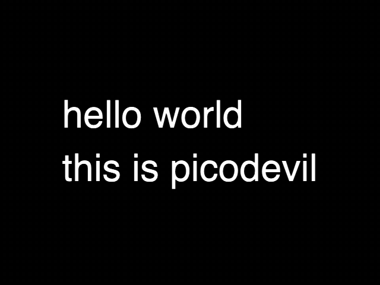
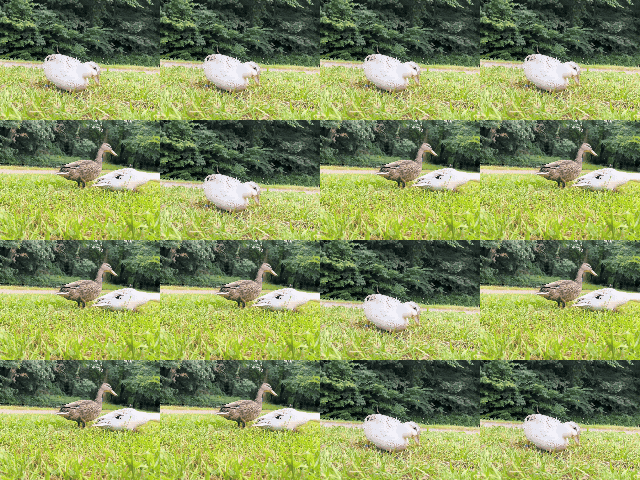
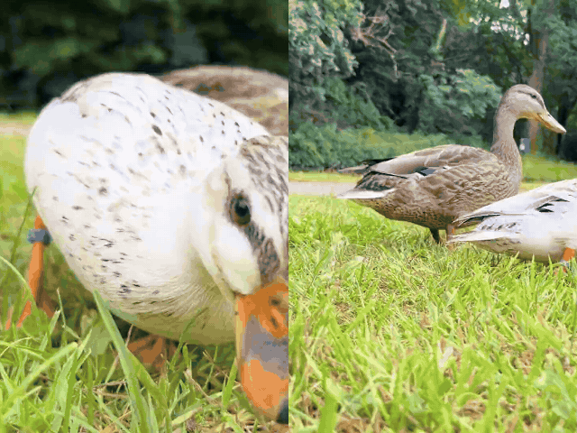
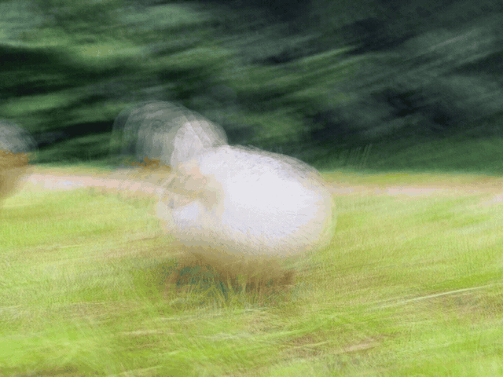

# picodevil

This is a livecoding tool that runs in the browser. It allows you to sample, cut up, and generally fuck about with videos. It's based on [Strudel](https://strudel.cc), adapting its capabilities to make more sense for visuals than for audio.

It's built by [V Buckenham](https://vbuckenham.com/) - hello! Let me know if you find bugs or make anything cool with it! 

This is my first time building a tool where I have used an LLM in a major way. Sorry if that upsets you! I feel uncertain about it for many reasons! But here we are.

## How to use

The easiest way to use Picodevil is to go to the hosted version at [picodevil.com](https://picodevil.com/). You can poke at the examples in the right hand sidebar, load them up, change some stuff, and then press Ctrl-Enter to see the results.

You can also load videos by opening the sidebar - click the little arrow on the right hand side of the window. There's also a reference to the functions in one of the tabs.

There's also an optional server, which will let you do things like transcode videos so they can be scrubbed backwards, and allow downloading from YouTube - see [picodevil-server](https://github.com/v21/picodevil-server) for details.

## If you want to run it locally

You can do this by cloning this repository (or downloading it), and then running:
`npm install`, then `npm run start` in the main folder

Then opening [http://localhost:5173/](http://localhost:5173/) in your browser.

## Project status

This is, I guess, a v1, although I'm not committing to any proper versioning right now. It has not been tested by very many people — mostly just me — although I feel confident enough in it to perform with it. There are areas that I expect to change - for example, the image effects like `grey()`, and the audio reactivity system (`fft[0]`). And I'm sure there's lots of bugs, and also rough areas that look like bugs but actually just haven't been fully thought through. As such, things might change without notice! If this is a worrying prospect for you, I encourage you to clone the repo and run it locally.

## How this works / Differences from Strudel

As mentioned, this project is heavily based on Strudel. I would like to have a nice onboarding which explains the basic concepts I've borrowed from there, and how to get going with Picodevil with no prior knowledge — but I haven't written it yet. Probably it'll come after I run a few workshops.

But, for those people who already know a little Strudel - the rest of this doc goes over how it's different. This should hopefully document some of the underlying architectural decisions, and also provide a bit of a tour of the things I've added. 

### First difference: "s" stands for "screen", not "sound"

Let's first have a tiny recap of some Strudel code:
```js
$: s("bd [hh hh]")
```

Now let's look at some Picodevil code:
```js
$: s("canalboat [ducks ducks]")
```


It's quite similar! We start with a `$:`, to allow us to stack up multiple lines of code. Then we have an `s()`, which contains a string within which there's some [mininotation](https://strudel.cc/learn/mini-notation/), and which plays some samples. But as the heading of this section says, in Strudel this stands for `sound`, and in Picodevil this stands for `screen`. So, instead of playing a basic drum loop, it plays a little video loop. Like this:


In this case, `ducks` and `canalboat` are both videoclips from the default set of clips. You can see a list of clips, and add more in the sidebar - click the arrow on the far right of the screen, then select the "videos" tab. You can add new videos by adding their URL in the top textbox, and you can rename them for referencing in code. Managing videos is easier if you run the server - you can find out more at [picodevil-server](https://github.com/v21/picodevil-server).

There are also other things you can refer to within `s()`. It can show:
- images - set via URL in the same way that videos are
- colours - you can just write `black` or `#FF00FF`
- screen or camera captures - set those up in the video sidebar
- previously rendered things — but this is a spoiler for the ninth section
- text - you can use the syntax `text:hello_world`, with underscores converted to spaces.

If you're displaying text, you can also do this:
```js
$: text('hello world\nthis is picodevil')
```


A few things worth noting here - we use single quotes rather than double quotes, so the string isn't interpreted as a pattern. And this also means we can enter a newline with `\n`.

There's a bunch of stuff you can do in terms of text styling — picking fonts and whatnot — but I'll let you look that up in the reference for yourself.

### Second difference: structure doesn't just come from the left

In general, Strudel operates by setting the pattern of notes from the leftmost pattern, and then mapping the properties of subsequent patterns onto those. Picodevil instead samples all patterns at the current time, and applies all of them to the current sources. This means that doing something like 
```js
$: s("ducks").scrollX(sine)
```


will smoothly scroll the video from right to left, rather than only sampling the position whenever the video changes. Whereas in Strudel `s("saw").gain(sine)`, a saw wave will be played every cycle, and it will sound the same throughout because the gain will only be set at the beginning of the sample.

### Third difference: we render frames rather than events

Strudel looks ahead and queues up notes with precise timing. Each note is sent as a new event, with its timing information attached. Picodevil runs at the browser's preferred framerate (using `requestAnimationFrame` - in practice probably 60FPS, or 120FPS if you're fancy). We sample all the events playing at the current instant, and we render those. If an event falls between frames, it won't be rendered. If two events are identical, and we miss the end of one and the beginning of another - it will be rendered exactly the same as if the event did not end and begin again. 

### Fourth difference: Picodevil is more interested in signals & continuous events

As we're sampling every frame, it becomes more natural to use continuously changing parameters in more places. Varying something by sine makes more sense if you are going to be sampling a new value for sine every frame. 

As such, we've added a few new functions for creating smooth signals - `lerp` and `spline`. These are inspired by [Hydra](https://hydra.ojack.xyz/)'s `smooth` method - they allow you to convert a discrete pattern into a continuous one : `"0 1".lerp()` smoothly moves from 0 to 1 over the course of a cycle (and then back again).

### Fifth difference: we index stacks

In Strudel, you often create "stacks" of patterns - multiple patterns that run in parallel. In Picodevil, you do this even more so! Frequently, you want to say something like "play this video 16 times in parallel, in a 4x4 grid, and change one of those instances to be a little different". Let's build that up: 

*Play a video*: 
```js
$: s("ducks")
```


*Play a video 16 times, all in sync*: Use `stackN` - 
```js
$: s("ducks").stackN(16)
```


Yes, it looks the same. That's because they're all the size of the screen, and all drawn on top of each other.

*Let's give them extra data to distinguish them*: You `index()` them, which adds `i` and `count` values to each one, and now patterns can distinguish between them. Like this:
```js
$: s("ducks").stackN(16).index()
```


Wait, it *still* looks the same! We added the `i` and `count` values, but we're not doing anything with them.

*Actually put them in a grid pattern already*: You can now call `tile` on them to do the layout: 
```js 
$: s("ducks").stackN(15).index().tile()
```


Whew! A grid of ducks!

Tile looks at the `count` value and tries to figure out a grid that will accommodate that many items. It actually calculates that grid independently for every screen it lays out, but they all agree on their `count` so it all works out. 

Although actually I made this more difficult than it needed to be. `stackN` already sets `i` and `count` for you, to be helpful. So 
```js
$: s("ducks").stackN(15).tile()
```
will actually work fine by itself. But if you do something like `$: s("ducks, canalboat")` (the `,` is the stack operator within the mininotation) then you need to follow it up with an `index`.

*Wait, that last row had 3 ducks instead of 4*: Yeah, we had 15 ducks so `tile` laid them out as close to a grid as it could. But we can insist on a particular number of rows and columns, and then use `grid` instead: 
```js
$: s("ducks").stackN(15).rows(4).cols(4).grid()
```


Or, if you want the items to repeat after they run out, you can use `gridMod`: 
```js
$: s("ducks").stackN(15).rows(4).cols(4).gridMod()
```


And, actually, now we're using `gridMod()`, we don't even need `stackN` any more:

```js
$: s("ducks").rows(4).cols(4).gridMod()
```


In case you're wondering, Picodevil has some logic behind the scenes so that all screens showing the same moment of the same video come from the same video source, so there's not really any performance impact between the two.

*Drawing one cell on top*: We can also use `i` and `count` to manually set the index and count on a single element. This lets us draw to a particular point on a grid... So, we could do: 
```js
$: s("ducks").stackN(15).stack(
  s("canalboat").i("0 1 2 3 4 5 6 7 8 9 10 11 12 13 14 15").count("16")
).rows(4).cols(4).gridMod()
```


and now there's a video of a canalboat drawing over each cell of the grid of ducks in turn.

### Sixth difference: seeding randomness

One thing you might want to do is to put in a grid of videos and then use something like `sometimes()` to apply extra things to a subset of randomly chosen cells. Strudel has an admirable commitment to determinism, and seeds its randomness from the onset time of events. This means that all the cells in a grid like above would have the same random seed, and would all pick the same outcome. As such, when you use `index()` (or something that calls it, like `stackN()`), it also sets a `_randSeed` value on the item, and we modify random functions to use that as part of the seed. The upshot of this is that
```js
$: s("ducks").stackN(16).sometimes(speed(-1)).tile()
```



makes a grid of ducks, some of which are moving backwards.

### Seventh difference: stack ordering

The order of a stack matters. What does that mean? It means if you do:
```js
$: s("ducks, canalboat").index().rows(3).cols(3).gridMod()
```


You'll get a 3x3 grid of ducks and canalboats repeating, with ducks appearing in the corners. But if you do

```js
$: s("canalboat, ducks").index().rows(3).cols(3).gridMod()
```


You get the canalboat footage in the corners. Starts at the top left, goes across, and then down.

If you want to shuffle that order, you can do... well, actually there's only two items, so there's only two orders you can have. We've seen them both already. But if we do 

```js
$: s("canalboat, ducks").stackN(5).index().rows(3).cols(3).gridMod()
```


Then there's now 10 items, distributed in 9 slots, which... looks the same as repeating two of them across those 9 slots. But! if then you add
```js
$: s("canalboat, ducks").stackN(5).shuffleIndex().rows(3).cols(3).gridMod()
```


You now shuffle all the `i` values passed through, and now you have a jumble of 5 `ducks` and 5 `canalboat`s in the grid. Which is a nice way to add a bit of interest. By default, this shuffles with a fixed seed, so you always get the same jumble for a given input. If you want to vary that, you can:
```js
$: s("canalboat, ducks").stackN(5).shuffleIndex(rand.segment(4)).rows(3).cols(3).gridMod()
```


(rand gets rerolled 4 times a frame, as we don't have the idea of events - so we need to segment it so it doesn't change every frame)

### Eighth difference: new ways to control playheads

As with Strudel, by default we play a sample from the beginning, at its natural speed, for as long as the event that triggers it lasts. This means that our default ducks (`$: s("ducks")`) play for one cycle, then reset back to the start, and do this repeatedly. 

You can of course change the speed (`speed`), and you can use Strudel functions like `fit()` to set the speed such that the clip will fit within a single cycle. And again, as with Strudel, you can change where a video plays from with `begin()` - this takes a value from 0-1, which represents how far through the clip you want to start. You can also set the end of the loop with `end()`, same deal. You can also set this with `duration()` - these two are just different ways of setting the same thing.

There's also a shorthand for this, useful when you're making patterns out of different bits of the same clip: `$: s("ducks:0:.2 ducks:.8")` - this plays ducks twice within a cycle, the first time from 0 to 0.2, the second time from 0.8 to the end.

While retriggering samples from the start repeatedly is good for audio, it's not always the right fit for video. Sometimes you want the video to play according to an underlying clock, even when it's not shown. You can do this with `sync()`, which causes videoclips to play relative to the start of cycle 0. This means they play all the way through before restarting (or til the end of the loop, anyway). 

If you want to use `sync` on two instances of the same clip, but don't want them to match, you can pass in an argument - `sync(0.5)` and `sync(0)` will be half-the-clip-length offset from each other. You could use this like so:
```js
$: stack(s("ducks").sync(0), s("ducks").sync(0.5)).index().tile() 
```



To put two clips of ducks next to each other, each offset in playhead position. Which is a neat effect. In fact, it's such a neat effect that there's a shorthand for it:
```js
$: s("ducks").syncStack(2).tile() 
```

As well as `sync()`, there's also a `rolling()` mode, which works slightly differently. This means that Picodevil doesn't try to manage the position of the playhead, and lets it just... roll through. You can also apply both of these at the same time - it'll use the sync offset initially, then keep rolling.

There's also another way to manage the playhead, which isn't actually a new way but really just an inventive way to use `begin()`. If you set `duration(0)` then the video will show a freeze frame. And if you instead drive `begin()`, say with a continuous signal like `sine`, you can scrub through the video - starting slow, rushing through the middle, slowing down at the end, before turning around and going back in reverse. This is neat enough there's a shorthand for it: `scrub(sine)`.

### Ninth difference: stack ordering again

Let's go back to that ideal of a stack:
```js
$: s("ducks, canalboat")
```


If you try this out, you'll notice that you only see the canalboat footage, and you don't see any ducks. This is because the canalboat footage has been drawn on top of the ducks. But you can draw things with transparency:
```js
$: s("ducks, canalboat").alpha(.5)
```


Hey, look, you can see them both! Kinda dark, because both are only half visible and there's a black background, but you can. Let's make only the canalboat footage transparent:
```js
$: s("ducks")
$: s("canalboat").alpha(.5)
```


Nice. We also have blend modes, so we could instead multiply the two feeds together:
```js
$: s("ducks")
$: s("canalboat").blend("multiply")
```


So far so cool. Now, in Strudel, the different lines following a `$:` are stacked together behind the scenes. We also do this. But, as we said before, in Picodevil, the ordering of stacked layers is important. One way it's important is that we also have some special values you can pass to `s()`. Like `"all"`. When you pass `all`, it renders out the whole screen as rendered so far as a pattern. So, for example:
```js
$: s("ducks").stackN(9).tile()
$: s("all").scale(0.5).grey()
```


Plays the `ducks` video, tiled 9 times, then layers in the center of the screen the same thing but in greyscale.

You can also reference `"prev"`, which gives you the output of the screen on the previous frame. This makes it easy to make feedback patterns:
```js
$: s("prev")
$: s("ducks").alpha(0.03)
```



Gives you a kind of temporal blur, smearing out motion over time.

You can also use the labels to pull particular layers in:
```js
quack: s("ducks").stackN(9).tile()
$: s("canalboat").alpha(.7)
$: s("quack").cropStack(4,4).tile().scale(.7)
```


Makes that 3x3 grid of ducks, and then on top of that draws the canalboat footage, and then on top of *that* draws that first grid of ducks, but now also sliced into a 4x4 grid, each of which is scaled down a bit so you can see the other grid behind.

If you want to *not* render some things directly, but use them later on, then you can also do that - in the same way that Strudel lets you prefix lines with `_` to mute or `S` to solo, you can also prefix things with `H` to hide:
```js
Hquack: s("ducks").stackN(9).tile()
$: s("quack").cropStack(2,2).tile().scale(.9)
```


Now you see black between each foreground chunk.

Oh, one thing to be aware of: if you reference a layer *before* it's rendered, it's picked up from the previous frame. Yes, you can use this to do feedback effects.

## More resources

Honestly, I need to write more! This hopefully covers a lot of the important concepts, although I admit it only really works if you already know Strudel. There's also an LLM-written [GUIDE](GUIDE.md), which goes over all the major systems one by one. I said this before, but I'd very much recommend playing with the examples - I've tried to demo most of the core things there. 